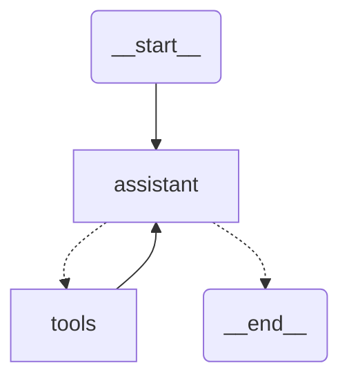

# LangGraph - Introduction

本文根据[Hugging Face上的Agent课程](https://huggingface.co/learn/agents-course/unit2/langgraph/introduction)编写而成。
在本章节您将学习如何使用 [LangGraph](https://github.com/langchain-ai/langgraph) 框架构建应用程序，该框架旨在帮助您构建和协调复杂的 LLM 工作流程。LangGraph 是一个框架，它通过为您提供代理流程的控制工具，允许您构建可用于生产的应用程序。
相关资源：
- [LangGraph 代理](https://langchain-ai.github.io/langgraph/) - LangGraph 代理示例
- [LangChain academy](https://academy.langchain.com/courses/intro-to-langgraph) - Full course on LangGraph from LangChain
# 什么是LangGraph，什么时候使用它？
LangGraph 是 [LangChain](https://www.langchain.com/) 开发的用于管理集成 LLM 的应用程序的控制流的框架。  
**那么，LangGraph与LangChain有什么不同？**LangChain 提供了一个标准接口，用于与模型和其他组件交互，可用于检索、LLM 调用和工具调用。LangChain 中的类可以在 LangGraph 中使用，但并非必须使用。这些包是不同的，可以单独使用，但最终，您在网上找到的所有资源都会同时使用这两个包。  
**什么时候应该使用 LangGraph？**  
当你需要做一个“控制”和“自由”之间的权衡：
- 控制：确保可预测行为并维护。
- 自由：让LLM有更多空间去发挥创造力。  
例如：CodeAgent非常自由，可以在单个操作步骤中调用多个工具，创建自己的工具等等，但这种行为可能让它们比使用JSON的常规代理更难以预测和控制。  

LangGraph则处于另一个极端，当您需要“控制”agent的执行时，就会发挥作用。它为您提供了构建遵循可预测流程的应用程序的工具，同时仍然充分利用 LLM 的强大功能。简而言之，如果您的应用程序涉及**一系列需要以特定方式协调的步骤，并且在每个连接点做出决策**， 那么 LangGraph 可以提供您所需的结构 。

LangGraph 擅长的关键场景包括：
- 需要明确控制流程的多步骤推理过程
- 需要在步骤之间保持状态的应用程序
- 将确定性逻辑与人工智能功能相结合的系统
- 需要人工干预的工作流程
- 具有多个组件协同工作的复杂代理架构
# LangGraph的构建模块
LangGraph 中的应用程序从入口点开始，并且根据执行情况，流程可能会转到一个函数或另一个函数，直到到达结束。

## State
State是 LangGraph 的核心概念。它代表了流经应用程序的所有信息。
```python
from typing_extensions import TypeDict

class State(TyprDict):
  graph_state: str
```
状态是用户定义的 ，因此字段应该精心设计以包含决策过程所需的所有数据！💡： 仔细考虑您的应用程序需要在步骤之间跟踪哪些信息。
## Node
Node 时Python函数。每个Node：
- 将状态作为输入
- 执行操作
- 返回状态更新
```python
def node_1(state):
  print("---Node 1----")
  return {"graph_state": state['graph_state']+"I am"}

def node_2(state):
    print("---Node 2---")
    return {"graph_state": state['graph_state'] +" happy!"}

def node_3(state):
    print("---Node 3---")
    return {"graph_state": state['graph_state'] +" sad!"}
```
Node可以包括什么呢？
- LLM 调用 ：生成文本或做出决策
- 工具调用 ：与外部系统交互
- 条件逻辑 ：确定下一步
- 人工干预 ：获取用户输入
整个工作流程所需的一些Node（如 START 和 END）直接存在于 langGraph 中。

## Edge
Edge连接Node并定义图中的可能路径：
```python
import random
from typing import Literal # Literal 类型允许你明确规定变量的具体可选值，这些值可以是字符串、整数、布尔值等不可变类型。
def decide_mood(state) -> Literal["node_2", "node_3"]:
    
    # Often, we will use state to decide on the next node to visit
    user_input = state['graph_state'] 
    
    # Here, let's just do a 50 / 50 split between nodes 2, 3
    if random.random() < 0.5:

        # 50% of the time, we return Node 2
        return "node_2"
    
    # 50% of the time, we return Node 3
    return "node_3"
```
Edges可以是：
- 直接 ：始终从节点 A 到节点 B
- 条件 ：根据当前状态选择下一个节点

## StateGraph
StateGraph 是保存整个代理工作流程的容器：
```python
from IPython.display import Image, display
from langgraph.graph import StaeGraph, START, END

# 创建状态图并添加节点
builder = StateGraph(State)
builder.add_node("node_1", node_1)
builder.add_node("node_2", node_2)
builder.add_node("node_3", node_3)

# 定义节点之间的连接关系（边）
builder.add_edge(START, "node_1")
builder.add_conditional_edges("node_1", decide_mood)
builder.add_edge("node_2", END)
builder.add_edge("node_3", END)

graph = builder.compile()

# View
display(Image(graph.get_graph().draw_mermaid_png()))

# 调用
graph.invoke({"graph_state": "Hi, this is Lance."})
# 输出
#---Node 1---
#---Node 3---
#{'graph_state': 'Hi, this is Lance. I am sad!'}
```
# 构建一个邮件助手吧！
在这一小节，我们会实现Alfred的电子邮件处理系统，他需要执行以下操作：
1. 阅读收到的电子邮件
2. 将其归类为垃圾邮件或合法邮件
3. 起草对合法电子邮件的初步回复
4. 在合法的情况下向韦恩先生发送信息（仅打印）
这是我们将构建的工作流程：

## 设置环境
```python
pip install langgraph langchain_openai

import os
from typing import TypedDict, List, Dict, Any, Optional
from langgraph.graph import StateGraph, START, END
from langchain_openai import ChatOpenAI
from langchain_core.messages import HumanMessage
```

## Step 1: Define Our State
使您的State足够全面以跟踪所有重要信息，但避免添加不必要的细节。
```python
class EmailState(TypedDict)
  # The email being processed
  email: Dict[str, Any] # Contains subject, sender, body, etc.

   # Category of the email (inquiry, complaint, etc.)
   email_category: Optional[str]

   # Reason why the email was marked as spam
   spam_reason: Optional[str]

   # Analysis and decisions
   is_spam: Optional[bool]

   # Response generation
   email_draft: Optional[str]

   # Processing metadata
   messages: List[DItc[str, Any]]
```
## Step 2: Define Our Nodes
现在我们创建构成节点的处理函数，想一想我们需要什么？
1. 小助手要读邮件，返回logs: 小助手在处理来自发送者某某关于某某主题的邮件
2. 小助手要判断是不是垃圾邮件，从LLM回答中提取is_spam，reason，category。
3. 小助手处理垃圾邮件
4. 小助手起草回复
5. 小助手回复整个过程
```python
# Initialize LLM
model = ChatOpenAI(temparature=0)

def read_email(state: EmailState):
  """Alfred reads and logs the incoming email"""
  email = state["email"]

  # Here we might do some initial preprocessing
  print(f"Alfred is processing an email from {email['sender']} with subject: {email['subject']}")

  # No state changes needed here
  return {}

def classify_email(state: EmailState):
  """Alfred uses an LLM to determine if the email is spam or legitimate"""
  email = state["email"]

  # prepare our prompt for the LLM
  prompt = f"""
    As Alfred the butler, analyze this email and determine if it is spam or legitimate.
    
    Email:
    From: {email['sender']}
    Subject: {email['subject']}
    Body: {email['body']}
    
    First, determine if this email is spam. If it is spam, explain why.
    If it is legitimate, categorize it (inquiry, complaint, thank you, etc.).
    """

    # call the LLM
    messages = [HumanMessage(content=prompt)]
    response = model.invoke(messages)

    # Simple logic to parse the response (in a real app, you'd want more robust parsing)
    response_text = response.content.lower()
    is_spam = "spam" in response_text and "not spam" not in response_text

    #Extract a reson if it's spam
    spam_reason = None
    if is_spam and "reason" in response_text:
      spam_reason = response_text.spilt("reason:")[1].strip()

    # Determine category if legitime
    email_category = None
    if not is_spam:
      categories = ["inquiry", "complaint", "thank you", "request", "information"]
      for category in categories:
        if category in response_text:
          email_category = category
          break
    
    # Update messages for tracking
    new_messages = state.get("messages", []) + [
      {"role": "user", "content": prompt},
      {"role": "assistant", "content": response.content}
    ]

    # Return state updates
    return {
      "is_spam": is_spam,
      "spam_reason": spam_reason,
      "email_category": email_category,
      "messages": new_messages
    }

def handle_spam(state: EmailState):
    """Alfred discards spam email with a note"""
    print(f"Alfred has marked the email as spam. Reason: {state['spam_reason']}")
    print("The email has been moved to the spam folder.")
    
    # We're done processing this email
    return {}

def draft_response(state: EmailState):
    """Alfred drafts a preliminary response for legitimate emails"""
    email = state["email"]
    category = state["email_category"] or "general"
    
    # Prepare our prompt for the LLM
    prompt = f"""
    As Alfred the butler, draft a polite preliminary response to this email.
    
    Email:
    From: {email['sender']}
    Subject: {email['subject']}
    Body: {email['body']}
    
    This email has been categorized as: {category}
    
    Draft a brief, professional response that Mr. Hugg can review and personalize before sending.
    """
    
    # Call the LLM
    messages = [HumanMessage(content=prompt)]
    response = model.invoke(messages)
    
    # Update messages for tracking
    new_messages = state.get("messages", []) + [
        {"role": "user", "content": prompt},
        {"role": "assistant", "content": response.content}
    ]
    
    # Return state updates
    return {
        "email_draft": response.content,
        "messages": new_messages
    }

def notify_mr_hugg(state: EmailState):
    """Alfred notifies Mr. Hugg about the email and presents the draft response"""
    email = state["email"]
    
    print("\n" + "="*50)
    print(f"Sir, you've received an email from {email['sender']}.")
    print(f"Subject: {email['subject']}")
    print(f"Category: {state['email_category']}")
    print("\nI've prepared a draft response for your review:")
    print("-"*50)
    print(state["email_draft"])
    print("="*50 + "\n")
    
    # We're done processing this email
    return {}
```
## Step 3: Define Our Routing Logic
我们需要一个函数来确定分类后要采取哪条路径：
```python
def route_email(state: EmailState) -> str:
    """Determine the next step based on spam classification"""
    if state["is_spam"]:
        return "spam"
    else:
        return "legitimate"
```
## Step 4: Create the StateGraph and Define Edges
```python
# Create the graph
email_graph = StateGraph(EmailState)

# Add nodes
email_graph.add_node("read_email", read_email)
email_graph.add_node("classify_email", classify_email)
email_graph.add_node("handle_spam", handle_spam)
email_graph.add_node("draft_response", draft_response)
email_graph.add_node("notify_mr_hugg", notify_mr_hugg)

# Start the edges
email_graph.add_edge(START, "read_email")
# Add edges - defining the flow
email_graph.add_edge("read_email", "classify_email")

# Add conditional branching from classify_email
email_graph.add_conditional_edges(
  "classify_email",
  route_email,
  {
    "spam": "handle_spam",
    "legitimate": "draft_response"
  }
)

# Add the final edges
email_graph.add_edge("handle_spam", END)
email_graph.add_edge("draft_response", "notify_mr_hugg")
email_graph.add_edge("notify_mr_hugg", END)

# Compile the graph
compiled_graph = email_graph.compile()
```
## Step 5: Run the Application
让我们用合法电子邮件和垃圾邮件来测试我们的图表：
```python
# Example legitimate email
legitimate_email = {
    "sender": "john.smith@example.com",
    "subject": "Question about your services",
    "body": "Dear Mr. Hugg, I was referred to you by a colleague and I'm interested in learning more about your consulting services. Could we schedule a call next week? Best regards, John Smith"
}

# Example spam email
spam_email = {
    "sender": "winner@lottery-intl.com",
    "subject": "YOU HAVE WON $5,000,000!!!",
    "body": "CONGRATULATIONS! You have been selected as the winner of our international lottery! To claim your $5,000,000 prize, please send us your bank details and a processing fee of $100."
}

# Process the legitimate email
print("\nProcessing legitimate email...")
legitimate_result = compiled_graph.invoke({
    "email": legitimate_email,
    "is_spam": None,
    "spam_reason": None,
    "email_category": None,
    "email_draft": None,
    "messages": []
})

# Process the spam email
print("\nProcessing spam email...")
spam_result = compiled_graph.invoke({
    "email": spam_email,
    "is_spam": None,
    "spam_reason": None,
    "email_category": None,
    "email_draft": None,
    "messages": []
})
```
## Step 6：使用 Langfuse 📡 检查我们的邮件分拣代理
随着 Alfred 对邮件分拣代理进行微调，他越来越厌倦调试它的运行。代理本身就难以预测，也难以检查。但由于他的目标是构建终极垃圾邮件检测代理并将其部署到生产环境中，因此他需要强大的可追溯性，以便日后进行监控和分析。
首先，`%pip install -q langfuse`,  
其次，我们 pip install Langchain （由于我们使用 LangFuse，因此需要 LangChain）：`%pip install langchain`。接下来，我们将 Langfuse API 密钥和主机地址添加为环境变量。您可以通过注册 Langfuse Cloud 或自行托管 Langfuse 来获取 Langfuse 凭据。
```python
import os
 
# Get keys for your project from the project settings page: https://cloud.langfuse.com
os.environ["LANGFUSE_PUBLIC_KEY"] = "pk-lf-..." 
os.environ["LANGFUSE_SECRET_KEY"] = "sk-lf-..."
os.environ["LANGFUSE_HOST"] = "https://cloud.langfuse.com" # 🇪🇺 EU region
# os.environ["LANGFUSE_HOST"] = "https://us.cloud.langfuse.com" # 🇺🇸 US region
```
然后，我们配置 [Langfuse callback_handler ](https://langfuse.com/docs/integrations/langchain/tracing#add-langfuse-to-your-langchain-application)并通过将 langfuse_callback 添加到图的调用来检测代理： config={"callbacks": [langfuse_handler]} 。
```python
from langfuse.callback import CallbackHandler

# Initialize Langfuse CallbackHandler for LangGraph/Langchain (tracing)
langfuse_handler = CallbackHandler()

# Process legitimate email
legitimate_result = compiled_graph.invoke(
    input={"email": legitimate_email, "is_spam": None, "spam_reason": None, "email_category": None, "draft_response": None, "messages": []},
    config={"callbacks": [langfuse_handler]}
)
```
# 构建一个秘书agent吧！
现在让我搭建一个助手Alfred，能够满足：
-  处理图像文档
-  使用视觉模型提取文本（视觉语言模型）
-  在需要时进行计算（演示常规工具）
-  分析内容并提供简明摘要
-  执行与文件相关的具体指令
秘书的工作流程遵循以下结构化模式：

## 设置环境
```python
import base64
from typing import List, TypedDict, Annotated, Optional
from langchain_openai import ChatOpenAI
from langchain_core.messages import AnyMessage, SystemMessage, HumanMessage
from langgraph.graph.message import add_messages
from langgraph.graph import START, StateGraph
from langgraph.prebuilt import ToolNode, tools_condition
from IPython.display import Image, display
```
`AnyMessage` 是来自 Langchain 的一个定义消息的类， `add_messages` 是一个添加最新消息而不是用最新状态覆盖它的操作符。这是 LangGraph 中的一个新概念，您可以在状态中添加操作符来定义它们之间的交互方式。
```python
class AgentState(TypedDict):
    # The document provided
    input_file: Optional[str]  # Contains file path (PDF/PNG)
    messages: Annotated[list[AnyMessage], add_messages]# 对于AnyMessage执行add_messages定义的操作
```
## 准备工具
1. 由于涉及到视觉，采用gpt-4o模型
2. 定义工具：使用视觉模型提取图中的文字，计算工具
```python
vision_llm = ChatOpenAI(model = "gpt-4o")

def extract_text(img_path: str) -> str:
  """
  Extract text from an image file using a multimodal model.
    
  Master Wayne often leaves notes with his training regimen or meal plans.    
  This allows me to properly analyze the contents.
  """
  all_text = ""
  try:
    # Read image and encode as base64
    with open(img_path, "rb") as image_file:
      image_bytes = image_file.read()#二进制数据

    image_base64 = base64.b64encode(image_bytes).decode("utf-8")# 二进制数据转换为文本格式

    # Prepare the prompt including the base64 image data
    message = [
      HumanMessage(
        content=[
          {
            "type": "text",
            "text":(
              "Extract all the text from this image. "
              "Return only the extracted text, no explanations."
            ),
          },
          {
            "type": "image_url",
            "image_url":{
              "url": f"data:image/png;base64,{image_base64}"# data:[<媒体类型>][;base64],<数据>
            },
          },
        ]
      )
    ]
    # Call the vision-capable model
    response = vision_llm.invoke(message)

    # Append extracted text
    all_text += response.content + "\n\n"
  return all_text.strip()
    except Exception as e:
      # A butler should handle errors gracefully
      error_msg = f"Error extracting text: {str(e)}"
      print(error_msg)
      return 

def divide(a: int, b: int) -> float:
    """Divide a and b - for Master Wayne's occasional calculations."""
    return a / b

# Equip the butler with tools
tools = [
    divide,
    extract_text
]

llm = ChatOpenAI(model="gpt-4o")
llm_with_tools = llm.bind_tools(tools, parallel_tool_calls=False)
```
## Nodes
1. 关于工具的文本描述
2. 系统prompt
3. 更新信息
```python
def assistant(state: AgentState):
    # System message
    textual_description_of_tool="""
extract_text(img_path: str) -> str:
    Extract text from an image file using a multimodal model.

    Args:
        img_path: A local image file path (strings).

    Returns:
        A single string containing the concatenated text extracted from each image.
divide(a: int, b: int) -> float:
    Divide a and b
"""
    image=state["input_file"]
    sys_msg = SystemMessage(content=f"You are a helpful butler named Alfred that serves Mr. Wayne and Batman. You can analyse documents and run computations with provided tools:\n{textual_description_of_tool} \n You have access to some optional images. Currently the loaded image is: {image}")

    return {
        "messages": [llm_with_tools.invoke([sys_msg] + state["messages"])],
        "input_file": state["input_file"]
    }
```
## The ReAct Pattern: How I Assist Mr. Wayne?
1. 思考他的文件和请求
2. 采用合适的工具采取行动
3. 观察结果
4. 根据需要重复，直到完全满足他的需要
同样的，我们需要构建graph，定义节点，添加edges
```python
# The graph
builder = StartGraph(AgentState)

# Define nodes: these do the work
builder.add_node("assistant", assistant)
builder.add_node("tools", ToolNode(tools))

# Define edges: these determine how the control flow moves
builder.add_edge(START, "assistant")
builder.add_conditional_edges(
    "assistant",
    # If the latest message requires a tool, route to tools
    # Otherwise, provide a direct response
    tools_condition,
)
builder.add_edge("tools", "assistant")
react_graph = builder.compile()

# Show the butler's thought process
display(Image(react_graph.get_graph(xray=True).draw_mermaid_png()))
```
我们定义一个 `tools` 节点，其中包含工具列表。 `assistant` 节点只是绑定了工具的模型。我们创建一个包含 `assistant` 和 `tools` 节点的图。我们添加了一个 `tools_condition` 边，该边根据 `assistant` 是否调用 `tools` 路由到 `End` 或工具。
使用实例：
1. 计算
```python
messages = [HumanMessage(content="Divide 6790 by 5")]
messages = react_graph.invoke({"messages": messages, "input_file": None})

# Show the messages
for m in messages['messages']:
    m.pretty_print()
```
```python
Human: Divide 6790 by 5

AI Tool Call: divide(a=6790, b=5)

Tool Response: 1358.0

Alfred: The result of dividing 6790 by 5 is 1358.0.
```
2.  Analyzing Master Wayne’s Training Documents
当韦恩留下他的训练计划和​​用餐笔记时：
```python
messages = [HumanMessage(content="According to the note provided by Mr. Wayne in the provided images. What's the list of items I should buy for the dinner menu?")]
messages = react_graph.invoke({"messages": messages, "input_file": "Batman_training_and_meals.png"})
```
```python
Human: According to the note provided by Mr. Wayne in the provided images. What's the list of items I should buy for the dinner menu?

AI Tool Call: extract_text(img_path="Batman_training_and_meals.png")

Tool Response: [Extracted text with training schedule and menu details]

Alfred: For the dinner menu, you should buy the following items:

1. Grass-fed local sirloin steak
2. Organic spinach
3. Piquillo peppers
4. Potatoes (for oven-baked golden herb potato)
5. Fish oil (2 grams)

Ensure the steak is grass-fed and the spinach and peppers are organic for the best quality meal.
```
